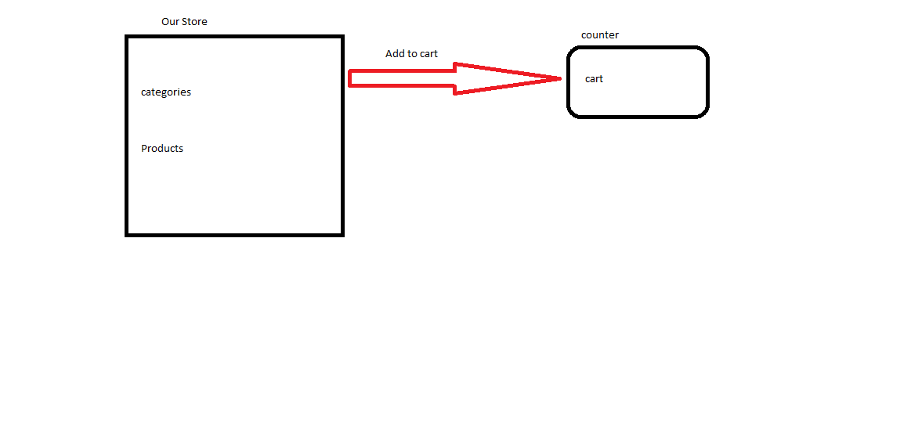

# Store Front

## LAB - Class 36

## Project: Store Front

## Author: Obada Tumah

## Links and Resources

[PR](#)

## PORT - 3000

### How to initialize/run your application (where applicable):

- npm start to start the code.

- npm test to test the code.

- npm run deploy to publish your project

